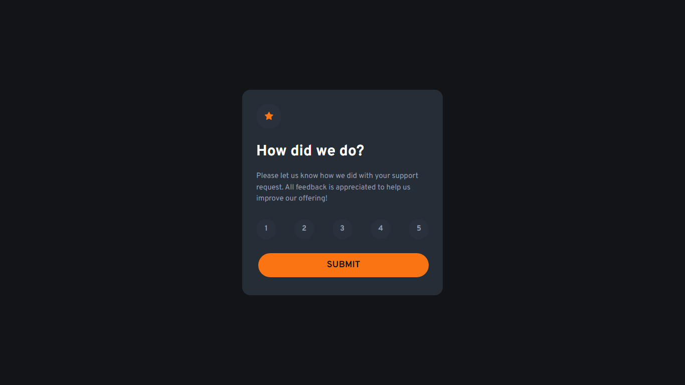

<h1>Interactive rating component solution</h1>

This is a solution to the [Interactive rating component challenge on Frontend Mentor](https://www.frontendmentor.io/challenges/interactive-rating-component-koxpeBUmI). 

</img>

- Solution URL: [Frontend Mentor](https://www.frontendmentor.io/solutions/interactive-rating-component-solution-5PtQ7HxAed)
- Live Site URL: [Deploy](https://kalebemax.github.io/interactive-rating-component-main/)

<h2>Built with</h2>

- Semantic HTML5 markup
- CSS custom properties
- Tailwind CSS
- JavaScript
- Flexbox
- VS Code
- Google Fonts
- Git
- Mobile-first workflow
